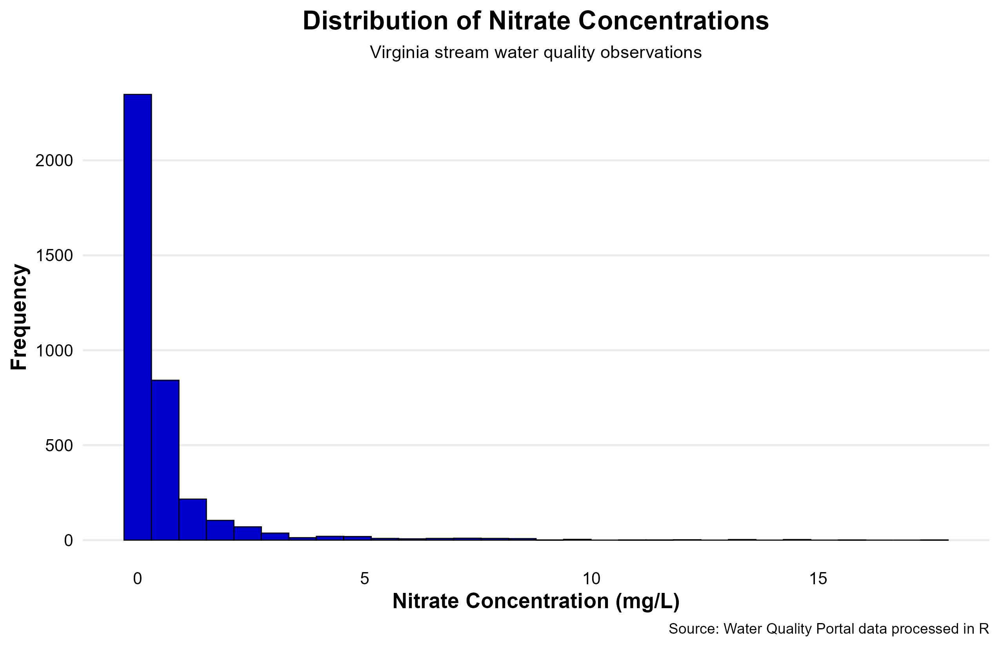
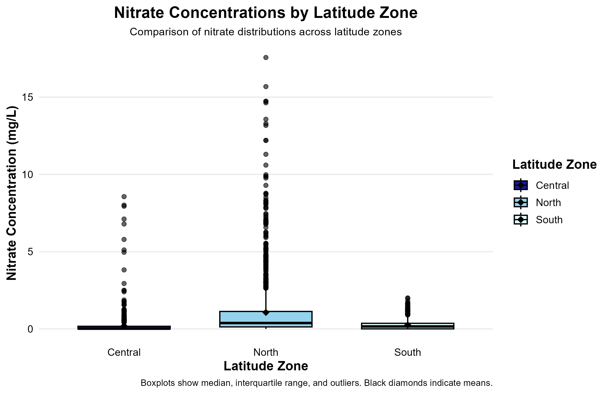
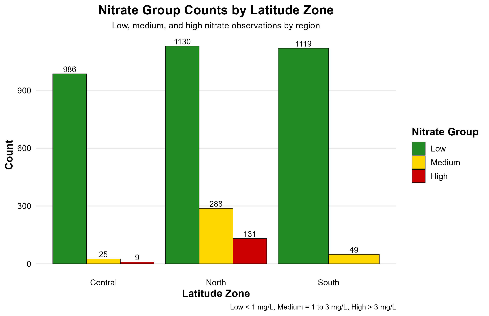

## Overview

This project analyzes Virginia stream water quality data using R, with a primary focus on nitrate concentrations. The purpose of the analysis was to examine how nitrate values were distributed across the dataset, determine whether nitrate concentrations differed by latitude zone, and evaluate whether nitrate category membership was associated with latitude zone.

## Skills Demonstrated

This project demonstrates data cleaning, data wrangling, categorical variable creation, descriptive statistics, inferential statistics, and professional data visualization in R. It also shows the use of reproducible project organization through separate folders for data, scripts, figures, and outputs.

## Research Questions

1.  How are nitrate concentrations distributed across the dataset?
2.  Do nitrate concentrations differ by latitude zone?
3.  Is nitrate group associated with latitude zone?

## Data Source

The dataset was derived from Water Quality Portal records that were cleaned and prepared for analysis in R. The working dataset included nitrate observations along with latitude zone classifications and related site information.

## Methods

The analysis was conducted in R using a cleaned observation-level dataset. Nitrate observations were filtered from the larger water quality file, and nitrate concentrations were converted to numeric values for analysis. A categorical nitrate grouping variable was created using the following thresholds: low for values less than 1 mg/L, medium for values from 1 to 3 mg/L, and high for values greater than 3 mg/L.

Descriptive statistics were calculated by latitude zone, including the mean, median, standard deviation, sample size, and standard error. A one-way analysis of variance was used to test whether nitrate concentrations differed across latitude zones. A chi-square test of independence was used to examine whether nitrate group membership was associated with latitude zone. Visualizations were created with ggplot2 to display the distribution of nitrate concentrations, differences by latitude zone, and the frequency of nitrate groups across regions.

## Results

The histogram showed that nitrate concentrations were concentrated at lower values, with fewer observations at higher concentrations. The boxplot indicated that nitrate concentrations varied across latitude zones, with the North zone showing a higher center and greater spread than the South and Central zones.

The analysis of variance showed a statistically significant difference in nitrate concentration among latitude zones, *F*(2, 3734) = 195.3, *p* \< .001. Mean nitrate concentration was highest in the North zone relative to the South and Central zones.

The chi-square test also showed a statistically significant association between nitrate group and latitude zone, χ²(4) = 432.87, *p* \< .001. Low nitrate observations were most common overall, but the North zone contained a noticeably larger number of medium and high nitrate observations than the other zones.

## Key Findings

The results suggest that nitrate concentrations were not evenly distributed across the study area. Most observations fell within the low nitrate category, but the North zone showed a greater concentration of elevated nitrate values. Together, the statistical tests and visualizations indicate meaningful geographic differences in nitrate conditions across Virginia stream observations in this dataset.

## Limitations

This project used an observational dataset, so the results identify patterns rather than cause-and-effect relationships. Sampling effort may not have been equal across all locations, and differences among latitude zones may partly reflect sampling density, land use variation, or other unmeasured factors. In addition, this project focused on nitrate only and did not evaluate interactions with other water quality variables.

## Project Files

Key files for this project include the cleaned dataset, analysis scripts, output tables, and exported figures. The workflow was organized so that data import, analysis, and figure creation were separated into individual scripts to improve clarity and reproducibility.

## Tools Used

R, RStudio, tidyverse, ggplot2, dplyr, janitor, here, descriptive statistics, ANOVA, chi-square test

## Figures

